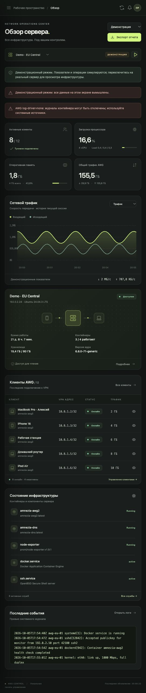

# AWG Control

Локальная веб-панель на PHP + JavaScript для диагностики и управления серверами AmneziaWG. Браузер получает данные через JSON API без перезагрузки страницы. SSH-сборщик написан на Python; устанавливать панель или агента на VPS не требуется.

В репозитории используются только демонстрационные данные. Адрес `192.0.2.10` в коде и тестах — синтетический пример для проверки режима **только чтение**. Настоящие адреса, SSH-реквизиты, ключи и конфигурации серверов храните только локально в каталоге `var/`, который исключён из Git.

## Интерфейс

Главная страница с графиками в **демонстрационном режиме**. Все показатели, адреса и имена на изображении вымышлены.



## Быстрый запуск

Требуются PHP 8.2+ с расширениями Sodium и mbstring, Python 3.10+ и OpenSSH. На управляемом Linux-сервере должен быть Python 3; диагностика использует существующие Docker, systemd и инструменты AWG/WireGuard. Отсутствующие инструменты показываются как недоступные источники. Сборка npm и Composer не нужны.

```sh
./bin/start
```

Откройте [http://127.0.0.1:8787](http://127.0.0.1:8787). Остановить сервер можно `Ctrl+C` в терминале. Ручной запуск из каталога проекта:

```sh
php -S 127.0.0.1:8787 -t public public/router.php
```

Панель рассчитана на локальный компьютер доверенного оператора. Не меняйте адрес прослушивания на `0.0.0.0` и не публикуйте встроенный PHP-сервер в интернете: самостоятельная система аккаунтов и внешняя авторизация здесь не предусмотрены.

## Работа с сервером

Выберите реальный режим для данных SSH или демонстрацию для изучения интерфейса. В демонстрации можно смотреть планы действий; их выполнение заблокировано. В случае SSH-ошибки панель показывает ошибку, а последний отображённый снимок помечает как устаревший.

Добавьте или выберите профиль сервера в настройках подключения: IP/DNS, SSH-порт, имя пользователя и пароль либо путь к локальному ключу. Сохраняемый пароль шифруется; пустое поле при редактировании сохраняет прежний пароль. Ключ должен позволять подключение без интерактивного ввода passphrase. Учётные данные передаются локальному API, а не стороннему сервису. Сверьте SSH-отпечаток с консолью провайдера перед закреплением доверия. Смена host/port сбрасывает закрепление; несовпадающий SSH-ключ блокирует подключение.

Состояние контейнера и состояние VPN-интерфейса отображаются отдельно. Недавний handshake означает недавний обмен с клиентом, но не подтверждает, что пользователь прямо сейчас передаёт полезный трафик. Счётчики RX/TX — значения на сервере, они могут сбрасываться после перезапуска интерфейса.

Для настоящих изменений используйте отдельный сервер, на котором вы разрешили запись. Перед выполнением панель формирует план с точной целью и последствиями; подтверждение цели относится только к этому плану. План принадлежит текущей сессии, действует 10 минут и используется один раз. Изменение профиля подключения или проверенного состояния конфигурации/службы/контейнера требует нового плана. Проверка режима только чтения действует и при прямом вызове API.

| Возможность | Реализованное поведение |
| --- | --- |
| Обзор | CPU, RAM, диск, uptime, сетевые счётчики, короткая история; Docker и VPN-интерфейс проверяются отдельно. |
| Контейнеры | Состояние, health, образ, порты, mounts, сети и ресурсы; start/stop/restart через план. |
| Службы | Список systemd, состояние и журналы; start/stop/restart через план. |
| AWG-клиенты | Объединение постоянного конфига, `clientsTable` и текущего интерфейса; имя, адрес, endpoint, handshake, RX/TX. Создание, переименование и отзыв на серверах с разрешённой записью. |
| Новый клиент | После создания доступны два формата одного подключения: AmneziaVPN (`vpn://`, `.vpn`, совместимые QR-коды) и нативный `.conf` для других клиентов. Формат выбирается в окне результата; ключ/конфиг можно скопировать или скачать, QR — скачать как SVG. Сохраняются известные параметры обфускации; keepalive по умолчанию `25` секунд, для AWG 3.1 — диапазон `25-35`. Закрытый ключ клиента не сохраняется в локальном хранилище панели. |
| Сеть | Интерфейсы, адреса, маршруты, слушающие порты, доступные правила iptables/ip6tables/nftables. |
| Журналы | systemd, ядро, SSH, службы, Docker и обнаруженные текстовые файлы; фильтры, экспорт и автообновление. |
| Обновление контейнера | Выполнение для проверенной службы Docker Compose v2 с исходными YAML-файлами; обычные контейнеры и контейнеры Amnezia получают только план. |
| Сервер | Перезагрузка через подтверждённый план; обновление ОС и полная резервная копия доступны как объяснение/план, автоматического выполнения нет. |
| Аудит | Локальная история сохранения профилей, доверия SSH-ключу, планов и выполнения. |

В клиентских изменениях поддерживается работающий интерфейс с конфигурацией, соответствующей его имени, и IPv4-подсетью до `/16` включительно. Если на интерфейсе также задан IPv6-префикс, новый клиент получает свободный IPv6-адрес, который сохраняется в peer и экспорте. `SaveConfig=true`, неизвестный формат таблицы клиентов и неоднозначные маршрутизируемые подсети блокируют изменение. Старые таблицы имён читаются для диагностики, но не мигрируются автоматически. Панель не включает системный VPN-туннель на устройстве, KillSwitch или split tunneling приложений.

Панель читает все 25 полей обфускации текущего [официального шаблона AWG](https://github.com/amnezia-vpn/amnezia-client/blob/dev/client/server_scripts/awg/template.conf). Значения смотрите через **Сеть → Конфигурация**; `HeaderProtectionKey` и остальные секреты скрыты. Общего редактора AWG-настроек нет. Новый `.conf` получает сохранённые параметры, включая клиентские `I1–I5` из комментариев официального серверного файла. Отсутствующие клиентские CPS и закрытые ключи восстановить нельзя. Полный VPN-клиент с системным автозапуском, KillSwitch и маршрутизацией отдельных приложений остаётся на пользовательском устройстве. Правила согласования сервера/клиента, диапазоны и требования Header Protection описаны в [справке совместимости](docs/AMNEZIA.md#параметры-awg).

В форме нового клиента можно изменить keepalive: целое число `0…65535` секунд, а для AWG 3.1 также диапазон `N-M` в этих пределах. `0` отключает периодический keepalive. При смене выбранного туннеля форма учитывает возможности его версии.

После создания клиента выберите **Формат подключения** в окне результата:

- **Для приложения AmneziaVPN** — гостевой ключ `vpn://`, текстовый файл `.vpn` и QR в формате AmneziaVPN. В приложении выберите **+ → QR-код**. Если подключение занимает несколько QR, переключайте их стрелками и отсканируйте все части. Кнопка скачивания сохраняет текущую часть SVG с номером в имени файла.
- **Для других клиентов · .conf** — нативная конфигурация и QR с её точным текстом. В мобильном AmneziaWG (или WireGuard для обычного WG-туннеля) выберите добавление туннеля и сканирование QR. Версия приложения должна поддерживать параметры туннеля. Если конфигурация превышает вместимость нативного QR, остаются копирование и скачивание `.conf`.

Переключение формата использует одно и то же подключение и не создаёт дополнительных клиентов. QR рисуются в браузере; внешние сервисы генерации не используются. Ключ, файлы и QR содержат приватный ключ: сохраните их до закрытия окна. После закрытия они удаляются из окна, повторно получить их в панели нельзя. Экспорт AmneziaVPN выдаёт гостевой VPN-доступ без SSH-реквизитов сервера. Формат проверен по [официальному экспортёру](https://github.com/amnezia-vpn/amnezia-client/blob/5.0.3.0/client/core/controllers/selfhosted/exportController.cpp) и [упаковке QR](https://github.com/amnezia-vpn/amnezia-client/blob/5.0.3.0/client/core/utils/qrCodeUtils.cpp); различия описаны в [инструкции Amnezia](https://docs.amnezia.org/documentation/instructions/share-connection/).

При наличии IPv6 в туннеле или списке DNS экспорт AmneziaVPN использует основной IPv4-адрес и заданные IPv4 DNS в метаданных клиента, как штатный гостевой экспорт приложения, и показывает пояснение. Если заданы только IPv6 DNS или адрес сервера указан как IPv6, доступен нативный формат. Полный набор адресов и DNS остаётся в `.conf`. Для полноценного IPv4/IPv6-подключения используйте этот файл в совместимом клиенте.

Обновление Compose сохраняет закрытую копию inspect/YAML и предыдущего файлового слоя контейнера в `/var/backups/awg-control/`, затем выполняет `pull` и `up -d --no-deps` для одной службы. Если новая служба не запустилась, применяется резервный образ. Данные томов сохраняются, но не входят в эту копию; миграции данных в томах таким откатом не отменяются. Контейнеры Amnezia обновляйте по официальной процедуре версии протокола.

## Логи и конфигурации

Раздел журналов читает существующие источники, допускает фильтрацию и скачивание. Доступность определяется настройками Docker, ОС и правами SSH-пользователя. Если контейнер использует `log-driver none`, записей `docker logs` нет — панель сообщает это явно. Логи клиентского приложения на телефоне/компьютере не находятся на VPS и требуют отдельного экспорта из AmneziaVPN.

Обновление через polling (обычно раз в 5 секунд) можно приостановить. Для живых журналов выдаётся до 2000 строк за запрос; чтение источников также ограничено объёмом. Фильтр времени/приоритета относится к journal, текстовые файлы используют последние строки и текстовый поиск. Панель не является архивом всей истории. Экспорт серверной конфигурации скрывает ключи и предназначен для диагностики. Закрытый ключ старого клиента восстановить по его публичному ключу невозможно.

Перед миграцией версии AWG прочитайте [совместимость и официальные источники](docs/AMNEZIA.md). В частности, официальный переход AWG 2.0 → 3.1 удаляет прежних пользователей и требует новых ключей. Обычное обновление образа не выполняет эту миграцию.

## Локальные данные

В каталоге `var/private/` находятся профили, зашифрованные SSH-секреты, кэш и журнал действий. Каталог имеет права `0700`, файлы с данными — `0600`. Sodium аутентифицирует шифротекст; ключ `var/private/secret.key` хранится рядом и должен оставаться доступен только вашему пользователю ОС. Шифрование не заменяет защиту локального компьютера.

Для изолированного хранилища задайте `AWG_DATA_DIR` перед запуском. Каталог не должен лежать внутри `public/`. Каталог `var/` исключён из Git; не включайте его в публикации или архивы исходников. Копирование профилей без `secret.key` делает сохранённые секреты нечитаемыми.

## Проверки

Проверки используют временное хранилище и синтетические данные, не подключаются к VPS и не запускают удалённые изменения:

```sh
python3 -m unittest discover -s tests -v
node --test tests/test_qr.js
```

При необходимости путь PHP задаётся переменной `AWG_TEST_PHP`. HTTP-тесты временно открывают свободный порт только на `127.0.0.1`; в ограниченной среде им требуется разрешение на локальный listen. Проверяются HTTP/CSRF и read-only барьеры, срок и принадлежность планов, шифрование и пути хранилища, AWG 3.1 параметры, отсутствие утечки ключей, создание/удаление клиентов и откат на синтетических SSH-ответах. Успех этих проверок не означает проверку операций записи на рабочем VPS.

## Структура

| Путь | Назначение |
| --- | --- |
| `public/` | Единственный каталог веб-сервера; HTML, CSS, JS и маршрутизатор. |
| `app/` | Локальный PHP API, планы действий, хранилище и демонстрация. |
| `scripts/` | SSH-транспорт и удалённая диагностика. |
| `var/` | Приватное локальное состояние, не веб-ресурсы. |
| `docs/AMNEZIA.md` | Ограничения, версии AWG и проверенные официальные источники. |
| `tests/` | Локальные проверки безопасности и совместимости. |

Визуальный компонент Canvas UI сохранён локально; сведения об источнике и лицензии находятся в `public/assets/vendor/NOTICE.md`.

Генератор QR Nayuki также сохранён в `public/assets/vendor/`; его лицензия MIT и источник указаны в том же файле. Для работы QR не нужны npm, подключение к CDN или дополнительный процесс на сервере.

При изменении JavaScript редактируйте `public/assets/app.js` или исходник Canvas UI, затем выполните `node bin/build-ui.js`. Node требуется только разработчику для этой команды: готовый `public/assets/app.bundle.js` включён в проект и подключается как обычный скрипт. Сборщик проверяет итоговый код настоящим парсером `vm.Script` перед сохранением bundle.
